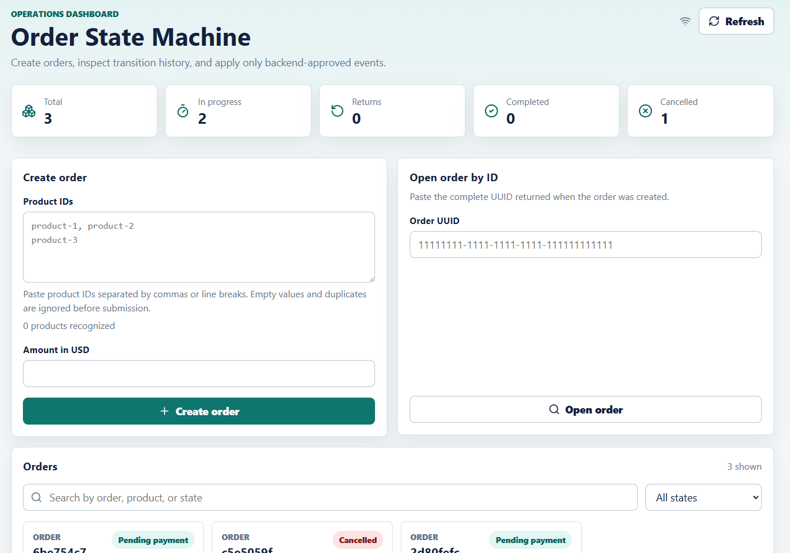
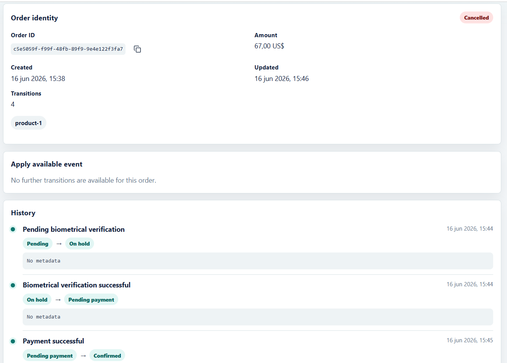
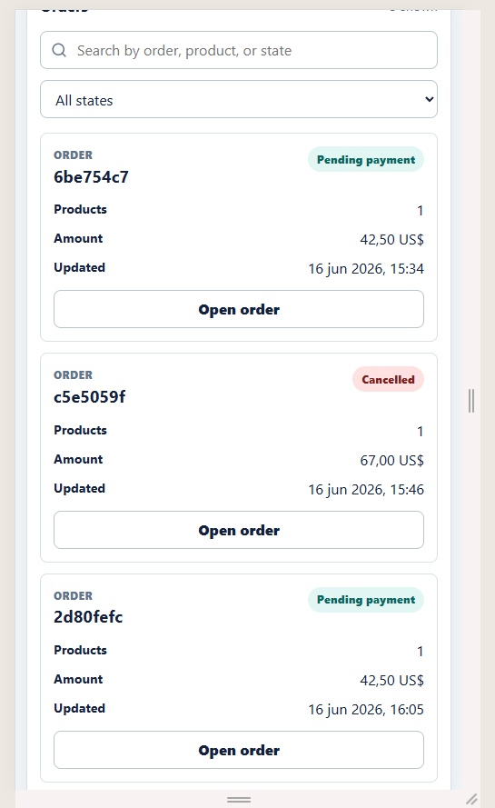
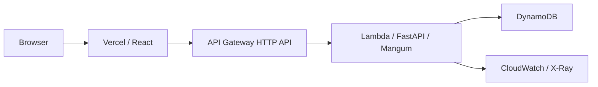

# Order State Machine

Order State Machine is a technical challenge project for creating, inspecting,
and advancing orders through backend-approved state transitions. It includes a
FastAPI backend, a React/Vite operations UI, local and DynamoDB persistence
adapters, and an AWS SAM deployment path for the backend.

## Live Demo

Frontend:

```text
https://order-state-machine-technical-test.vercel.app
```

API documentation is available at `<ApiBaseUrl>/docs` while the AWS stack is
deployed. The API Gateway URL is intentionally not committed to this repository.

## Screenshots







## Requirements Coverage

| Requirement | Implementation |
| --- | --- |
| Create an order with product IDs and amount | `POST /orders` validates product IDs, removes duplicates, and requires a finite positive amount. |
| Inspect the current state | Order detail and summary responses expose `currentState`. |
| Apply only valid transitions | `OrderStateMachine` owns the transition table used by the service and the API. |
| Reject invalid transitions | Invalid state/event pairs raise a domain error and return HTTP 409. |
| Event-specific business behavior | Event application records history and moves the order to the next allowed state. |
| High-value `paymentFailed` support-review ticket | High-value payment failures create a support ticket in the repository transaction. |
| Repository pattern for external persistence | Services depend on `OrderRepository`, not concrete storage adapters. |
| Service/router/repository separation | FastAPI routers call services; services call repository ports and domain logic. |
| Event history | Transition history is stored as separate event entries and returned in order detail. |
| In-memory persistence option | `PERSISTENCE_BACKEND=memory` uses the in-memory adapter for local tests and simple runs. |
| DynamoDB persistence option | `PERSISTENCE_BACKEND=dynamodb` uses the one-table DynamoDB adapter. |
| State-machine visualization | The frontend renders backend-provided states and transitions, including a responsive inventory. |
| Serverless AWS deployment bonus | SAM deploys API Gateway HTTP API, Lambda/FastAPI/Mangum, and DynamoDB. |
| Lambda Powertools observability bonus | Lambda uses Powertools Logger, Tracer, Metrics, and cold-start metrics. |

## Architecture



Local development can also run the backend directly with Uvicorn and either
in-memory storage or DynamoDB Local.

The backend also includes a local dynamic business-rule MVP. It loads rules
from `backend/app/rules/default_rules.json` during dependency initialization and
applies them after state-machine validation. See
[docs/rule-engine-mvp.md](docs/rule-engine-mvp.md) for the rule model,
supported actions, and persistence policies.

## Key Design Decisions

- The backend is the source of truth for valid transitions; the frontend only
  renders state-machine metadata returned by the API.
- DynamoDB transitions use one atomic transaction for the order update, event
  item, and optional support ticket.
- `Order.version` provides optimistic locking. Stale writes become
  `OrderVersionConflictError` and are mapped to HTTP 409 where appropriate.
- Repository ports keep service logic independent from in-memory and DynamoDB
  persistence details.
- DynamoDB uses one table with `PK`, `SK`, `GSI1PK`, and `GSI1SK`.
- `GET /orders` uses `GSI1`; the index is eventually consistent.
- Individual order base-table reads use `ConsistentRead=True`.
- In-memory transition mutation is protected with per-order locking.
- `ClientRequestToken=str(event_log.id)` protects identical retries of one
  constructed repository operation, but it is not HTTP-level idempotency.
- Lambda serves FastAPI through Mangum and uses the API Gateway stage prefix as
  FastAPI `root_path` so `/docs` resolves `<ApiBaseUrl>/openapi.json` correctly.
- The deployed Lambda role is generated by SAM and scoped to the DynamoDB
  operations the application uses.

## Technology Stack

- Backend: Python 3.14, FastAPI, Pydantic, boto3, Mangum
- Persistence: in-memory adapter, DynamoDB, DynamoDB Local
- Observability: AWS Lambda Powertools, CloudWatch, X-Ray
- Frontend: React, TypeScript, Vite, Vitest, Testing Library
- Infrastructure: AWS SAM, API Gateway HTTP API, Lambda, DynamoDB
- Tooling: Pyright, pytest, Docker Compose, ESLint

## Local Quick Start

Backend:

```bash
cd backend
python -m venv .venv
```

PowerShell:

```powershell
.\.venv\Scripts\Activate.ps1
python -m pip install -r requirements.txt
uvicorn app.main:app --reload
```

Unix-like shells:

```bash
source .venv/bin/activate
python -m pip install -r requirements.txt
uvicorn app.main:app --reload
```

Frontend:

```bash
cd frontend
npm install
npm run dev
```

The frontend reads:

```text
VITE_API_BASE_URL=http://localhost:8000
```

from `frontend/.env` when present. Use `frontend/.env.example` as the template.

Backend local defaults are documented in `backend/.env.example`. For DynamoDB
Local, fake local AWS credentials are enough; do not use real AWS keys in local
`.env` files.

## Docker Compose Stack

The Compose stack starts DynamoDB Local, creates the table, runs the backend in
DynamoDB mode, and starts the frontend:

```bash
docker compose up --build
```

Services:

- DynamoDB Local: `http://localhost:8001`
- Backend: `http://localhost:8000`
- Frontend: `http://localhost:5173`

Stop the stack:

```bash
docker compose down
```

## AWS SAM Deployment

SAM deploys only the backend and DynamoDB infrastructure. The frontend remains
hosted separately, such as on Vercel.

Required local tools:

- AWS CLI v2
- AWS SAM CLI
- Docker

Run SAM commands from `infra`, where `template.yaml` and `samconfig.toml` are
colocated. SAM builds in a container because Lambda runs on Linux and the
project includes native Python dependencies.

Validate credentials:

```powershell
aws sts get-caller-identity --profile <profile>
aws configure get region --profile <profile>
```

Stop before deployment if the STS identity ARN ends in `:root`.

Validate and build:

```powershell
cd infra
sam validate --lint
sam build
```

First deployment:

```powershell
cd infra
sam build
sam deploy --guided --profile <profile>
```

Subsequent deployments:

```powershell
cd infra
sam build
sam deploy --profile <profile>
```

Configure `FrontendOrigins` with exact origins only, for example:

```text
http://localhost:5173,https://your-project.vercel.app
```

The value configures both API Gateway CORS and the backend
`CORS_ALLOWED_ORIGINS` environment variable. Do not use wildcard CORS with this
application.

Post-deployment smoke test:

```bash
python backend/scripts/smoke_test.py --base-url <ApiBaseUrl>
```

## Testing And Coverage

Static analysis:

```bash
npx --yes pyright --project pyrightconfig.json
```

Backend unit tests:

```bash
cd backend
python -m pytest tests -m "not integration"
cd ..
```

DynamoDB Local integration tests:

```bash
docker compose up -d dynamodb-local
cd backend
RUN_DYNAMODB_INTEGRATION=1 python -m pytest tests -m integration
cd ..
docker compose down
```

PowerShell integration-test environment variable:

```powershell
cd backend
$env:RUN_DYNAMODB_INTEGRATION = "1"
python -m pytest tests -m integration
Remove-Item Env:RUN_DYNAMODB_INTEGRATION
cd ..
```

Backend coverage:

```bash
cd backend
python -m pytest tests -m "not integration" --cov=app --cov-branch --cov-report=term-missing
cd ..
```

Frontend validation:

```bash
cd frontend
npm run lint
npm run build
npm run test:run
npm run test:coverage
cd ..
```

Generated coverage output is ignored by Git.

## CI and SonarCloud

Pull requests and pushes targeting `main` and `develop` run GitHub Actions validation for Pyright,
backend coverage, frontend lint/build/coverage, and a SonarCloud quality-gate
scan. The workflow can also be started manually from GitHub Actions.

Manual repository setup:

1. Create the `SONAR_TOKEN` repository secret.
2. Create `SONAR_ORGANIZATION` and `SONAR_PROJECT_KEY` repository variables.
3. Disable SonarCloud Automatic Analysis before using CI-based analysis.
4. After the first successful run, protect `main` and `develop` and require the CI and
   SonarCloud quality-gate checks.

## API Endpoints

- `GET /health`
- `POST /orders`
- `GET /orders`
- `GET /orders/{order_id}`
- `GET /orders/{order_id}/available-events`
- `POST /orders/{order_id}/events`
- `GET /state-machine`
- `GET /docs`
- `GET /openapi.json`

Create an order:

```json
{
  "productIds": ["product-1", "product-2"],
  "amount": 1200.5
}
```

Apply an event:

```json
{
  "eventType": "noVerificationNeeded",
  "metadata": {
    "source": "checkout"
  }
}
```

## Known Limitations

- The public demo API has no authentication.
- `GET /orders` uses a DynamoDB GSI and is eventually consistent.
- Lambda and API Gateway may experience cold starts.
- `GSI1PK=ORDERS` is acceptable for the challenge, but high scale would require
  sharding or bucketing.
- HTTP-level client idempotency keys are not implemented.
- Assembled order detail reads are not a multi-operation transactional snapshot.
- The deployed AWS stack may be removed after evaluation to avoid retaining
  cloud resources.

## Teardown

Delete the SAM stack when it is no longer needed:

```powershell
cd infra
sam delete --profile <profile>
```

Remove local containers:

```bash
docker compose down
```
