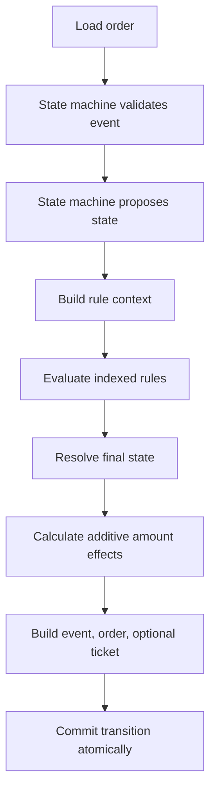

# Dynamic Rule Engine MVP

## Problem

Order transitions already have two distinct responsibilities:

- `OrderStateMachine` validates lifecycle events and proposes the next state.
- `OrderService` orchestrates persistence and side effects atomically.

The MVP adds dynamic business policy without moving that policy into the state
machine. Rules are represented as local JSON data so the rule catalog can grow
without changing transition-table code.

## JSON Rule Shape

Rules live in `backend/app/rules/default_rules.json` and are loaded once during
dependency initialization. A rule declares its event, current source states, a
condition tree, and safe actions:

```json
{
  "id": "high-value-payment-failure",
  "name": "High-value payment failure support review",
  "enabled": true,
  "eventType": "paymentFailed",
  "fromStates": ["Pending"],
  "condition": {
    "type": "CONDITION",
    "field": "amount",
    "operator": "GREATER_THAN",
    "value": 1000
  },
  "actions": [
    {
      "type": "CREATE_SUPPORT_TICKET",
      "parameters": {
        "reason": "High-value order payment failed"
      }
    }
  ]
}
```

Condition trees support nested `AND` and `OR` groups:

```json
{
  "type": "GROUP",
  "operator": "OR",
  "children": [
    {
      "type": "CONDITION",
      "field": "destinationCountry",
      "operator": "EQUALS",
      "value": "US"
    },
    {
      "type": "GROUP",
      "operator": "AND",
      "children": [
        {
          "type": "CONDITION",
          "field": "amount",
          "operator": "GREATER_THAN",
          "value": 1000
        },
        {
          "type": "CONDITION",
          "field": "manualReviewRequired",
          "operator": "EQUALS",
          "value": true
        }
      ]
    }
  ]
}
```

`SET_FINAL_STATE` is an explicit post-validation action:

```json
{
  "type": "SET_FINAL_STATE",
  "parameters": {
    "state": "OnHold"
  }
}
```

For this MVP, `SET_FINAL_STATE` validates only that the configured target maps
to a known `OrderState`. The state machine still validates the base transition
first, and the override can only replace that valid proposed state afterward.
Because allowed override targets are not yet modeled per event and source
state, configuration can currently select a semantically surprising state. A
production version should validate allowed override targets for the event and
source-state pair before rules become runtime-managed.

## Rule Model

Rules are selected by `eventType` and current order state. The engine builds an
immutable index equivalent to:

```text
RuleIndexKey(event_type, from_state) -> tuple[OrderRule, ...]
```

Only indexed candidates are evaluated. The index does candidate selection only;
each candidate still evaluates its full condition tree.

Supported fields:

- `amount`
- `productCount`
- `currentState`
- `proposedState`
- `eventType`
- `originCountry`
- `destinationCountry`
- `manualReviewRequired`

`amount` and `productCount` come from the order. `currentState`,
`proposedState`, and `eventType` come from the transition context.
`originCountry`, `destinationCountry`, and `manualReviewRequired` come from
event metadata for this MVP.

Fields are resolved through an explicit resolver registry. The engine does not
use `getattr`, reflection, executable expressions, scripts, or `eval`.

Supported operators:

- `EQUALS`
- `NOT_EQUALS`
- `GREATER_THAN`
- `LESS_THAN`
- `IN`

`GREATER_THAN` and `LESS_THAN` are accepted only for numeric fields: `amount`
and `productCount`.

Missing metadata evaluates to `False` for every comparison, including
`NOT_EQUALS`. This prevents absent user-provided data from accidentally making a
rule match.

Supported actions:

- `CREATE_SUPPORT_TICKET`
- `ADD_TAX`
- `ADD_FIXED_COST`
- `SET_FINAL_STATE`

Actions run through handlers that return pure effects. Handlers do not persist,
mutate orders, generate UUIDs, generate timestamps, or call repositories.

## OrderService Flow



Detailed flow:

1. Load the order.
2. Copy event metadata defensively.
3. Save expected version and current source state.
4. Ask `OrderStateMachine.get_next_state(...)` for the proposed state.
5. Stop before rule evaluation if the transition is invalid.
6. Build `RuleContext` with the original order, event, metadata, source state,
   and proposed state.
7. Evaluate only rules indexed by event and source state.
8. Resolve the final state after optional overrides.
9. Calculate the final amount from additive monetary effects.
10. Build one shared timestamp.
11. Build the event log with the final state.
12. Build the updated order with final state, final amount, incremented version,
    and copied history.
13. Materialize zero or one support ticket.
14. Call `OrderRepository.commit_transition(...)` exactly once.

The state machine validates lifecycle transitions. The rule engine applies
additional business policy. `SET_FINAL_STATE` happens only after a valid base
transition exists, so rules cannot make invalid events valid and do not mutate
the transition table.

When a final-state override occurs, the event metadata records:

```json
{
  "rule_state_override": {
    "proposed_state": "Confirmed",
    "final_state": "OnHold",
    "matched_rule_ids": ["manual-review-payment-success"]
  }
}
```

This makes the persisted event explain why the final state differs from the
state-machine proposal.

## Policies

State overrides use a deterministic minimal policy:

- No override: use the state proposed by the state machine.
- One override: use that state.
- Multiple overrides with the same state: deduplicate and use that state.
- Multiple overrides with different states: raise
  `RuleStateOverrideConflictError` and do not persist.

Conflicting overrides fail instead of relying on JSON order. The MVP does not
include priorities, first-rule-wins, last-rule-wins, exclusive groups, or a
generic conflict resolver.

The current parser accepts any known `OrderState` for `SET_FINAL_STATE`. This is
an explicit MVP boundary, not a state-machine change. The state machine proposes
a valid base state before rules run; the override is post-validation business
policy and cannot make an invalid event valid.

Monetary actions are additive:

```text
base_amount = original order.amount
tax_amount = base_amount * sum(tax percentages) / 100
final_amount = base_amount + tax_amount + sum(fixed costs)
```

All percentages use the original amount, so action order does not affect the
result. The project keeps the existing `float` amount representation for
compatibility.

The MVP persists only the final calculated `Order.amount`. It does not persist a
separate monetary-adjustment ledger containing the base amount, individual tax
effects, individual fixed-cost effects, or monetary rule IDs. As a result, the
final event does not provide full financial reconstruction of every monetary
adjustment. A production financial implementation should store immutable
adjustment records or an equivalent auditable breakdown.

Support-ticket drafts are aggregated because the repository still accepts one
optional `SupportTicket`:

- No drafts: no ticket.
- One draft: keep its reason and existing metadata shape.
- More than one draft: create one ticket with reason
  `Multiple rule-based support reviews required`, deduplicated reasons, and
  deduplicated matched rule IDs.

The existing high-value payment-failure ticket behavior is preserved:

```json
{
  "order_amount": 1200.5,
  "event_metadata": {
    "source": "checkout"
  }
}
```

## Persistence

Atomic persistence remains the responsibility of `OrderRepository`:

```text
updated order + event log + optional aggregated support ticket
```

The rule engine and action handlers perform no writes. DynamoDB updates
`currentState`, `amount`, `version`, and `updatedAt` inside the existing
transaction. No table schema or infrastructure change is required because
`amount` is already stored on the order item.

Optimistic locking remains based on the loaded source state and expected
version. A state override changes the final persisted state, but it does not
weaken the source-state/version condition.

Optimistic locking prevents concurrent lost updates for the same loaded order
version. It does not prevent a rule from being applied again during a later,
separate valid event. `ClientRequestToken` protects retries of one already-built
DynamoDB transaction, not rule-level or HTTP-level idempotency. Reliable replay
protection would need a persistent execution identity such as order ID, event ID
or client idempotency key, rule ID, and rule version, plus rule-execution
records.

## MVP Limits And Future Work

This MVP intentionally keeps several limits explicit:

- Override target restrictions are not yet modeled per event and source state.
- Rules are loaded once from local JSON and are not dynamically reloaded.
- There is no monetary-adjustment ledger for tax or fixed-cost effects.
- There is no persistent rule-execution audit.
- Optimistic locking is not rule-level or HTTP-level idempotency.
- There is no rule versioning or approval workflow.
- External actions would require an outbox and idempotency design later.

A future `DynamoDBRuleRepository` can implement the same `RuleRepository` port
and return typed `OrderRule` values. That would not require changing
`OrderService`, the evaluator, or action handlers. Future administration can
add runtime management, versioning, approvals, auditing, richer conflict
policies, and an outbox for external integrations around the same core
boundary.
